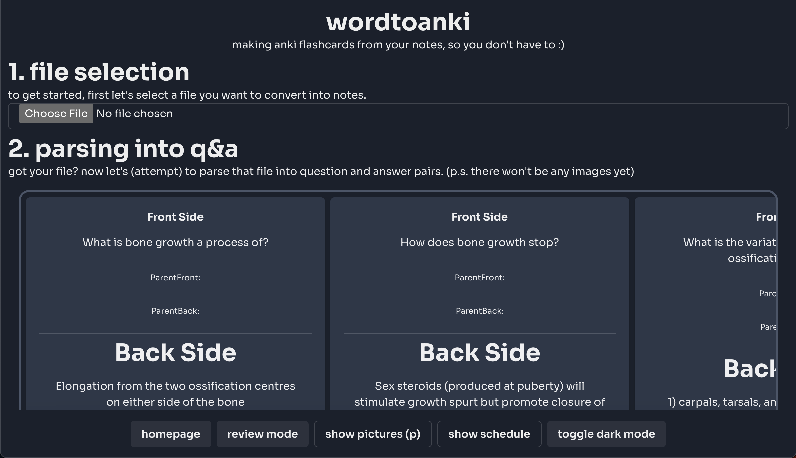
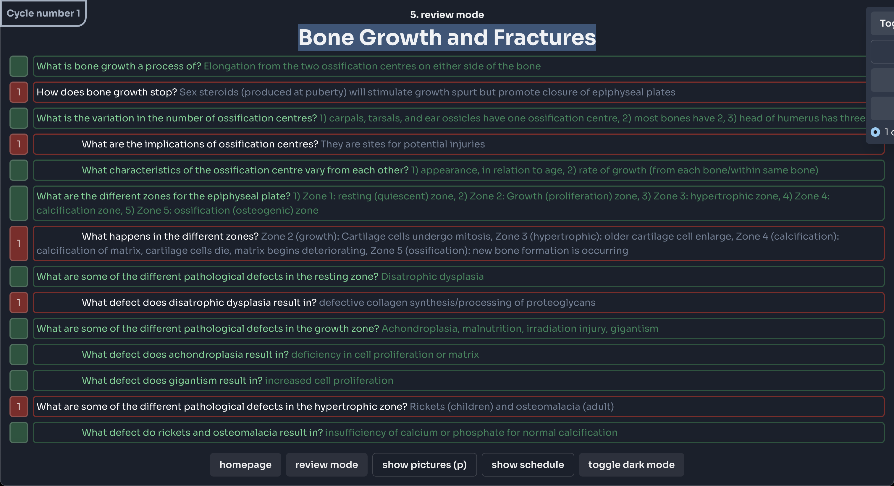
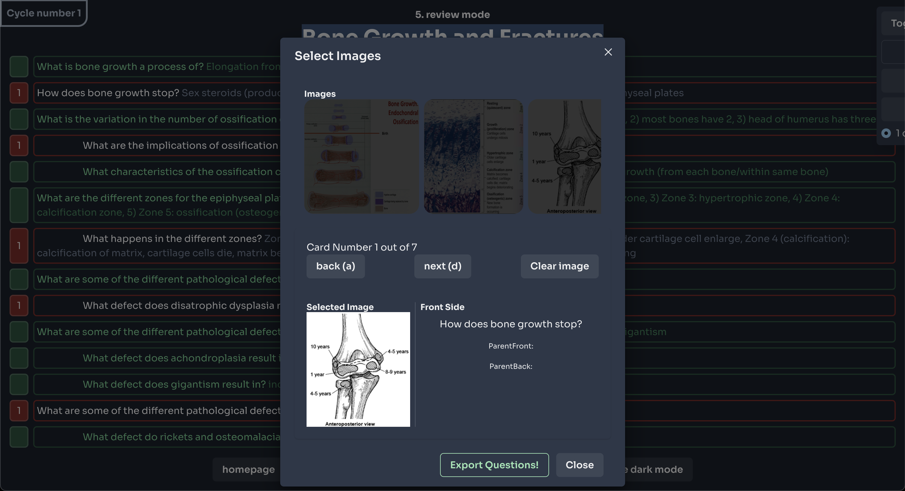

# wordtoanki

An automatic flashcard generator and study tool, **wordtoanki** helps reduce the time spent on making flash cards and helps optimize the time spent studying. It utilizes effective studying techniques such as active recall, and space reptition, all the while being easy-to-use and makes studying more enjoyable.

## Table of Contents
- [wordtoanki](#wordtoanki)
  - [Table of Contents](#table-of-contents)
  - [Features](#features)
  - [Installation](#installation)
    - [Prerequisites](#prerequisites)
    - [Steps](#steps)
  - [Usage](#usage)
  - [Screenshots](#screenshots)
  - [Technologies Used](#technologies-used)
  - [Contributing](#contributing)
  - [License](#license)
  - [Contact](#contact)

## Features
- Formats notes into question-answer pairs to easy studying
- Built-in review mode to studying formatted question
- Exports to CSV for easy anki import

## Installation
### Prerequisites
- npm (v9.6.7) or yarn (v1.22.19)
### Steps
1. Clone the repository
    ```sh
    git clone https://github.com/your-username/project-name.git
    ```
2. Navigate to the project directory
    ```sh
    cd project-name
    ```
3. Install dependencies
    ```sh
    npm install
    # or
    yarn install
    ```

## Usage
1. Start the development server

```sh
npm start
# or
yarn start
```
2. Open your browser and navigate to http://localhost:3000

## Screenshots




## Technologies Used
- React
- Chakra UI
- Javascript
- HTML

## Contributing
Contributions are what make the open-source community such an amazing place to learn, inspire, and create. Any contributions you make are greatly appreciated.


1. Fork the Project
2. Create your Feature Branch (`git checkout -b feature/AmazingFeature`)
3. Commit your Changes (`git commit -m 'Add some AmazingFeature'`)
4. Push to the Branch (`git push origin feature/AmazingFeature`)
5. Open a Pull Request

## License
Distributed under the MIT License. See `LICENSE` for more information.

## Contact
Ahmed Imana - ahmedimana.work@gmail.com

Project Link: https://github.com/meguta/wordtoanki

